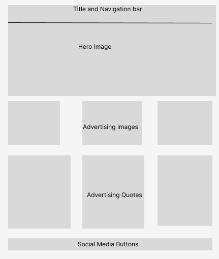
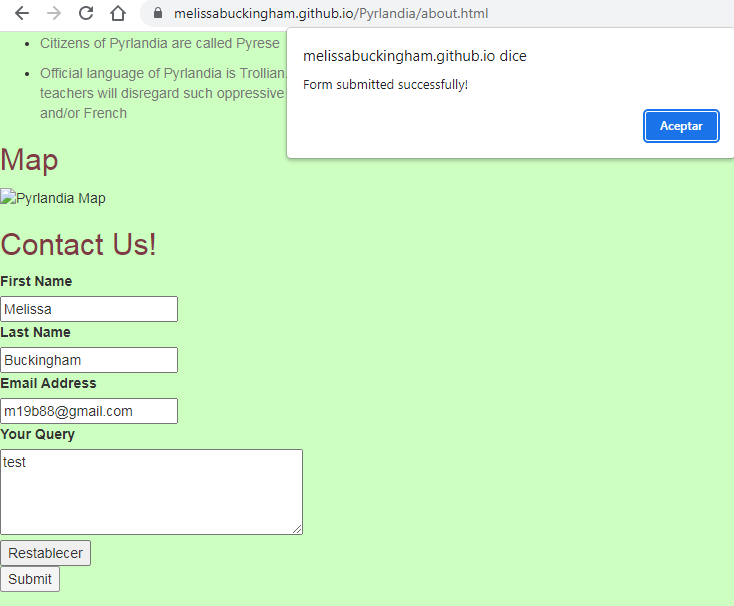
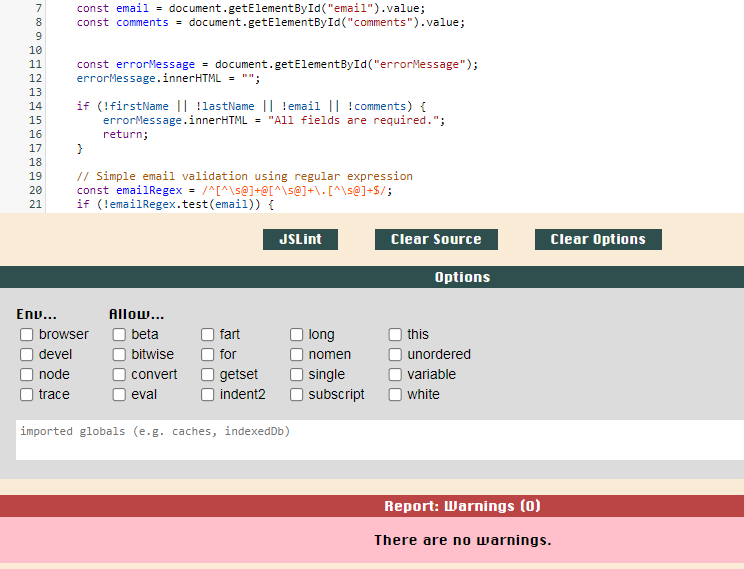
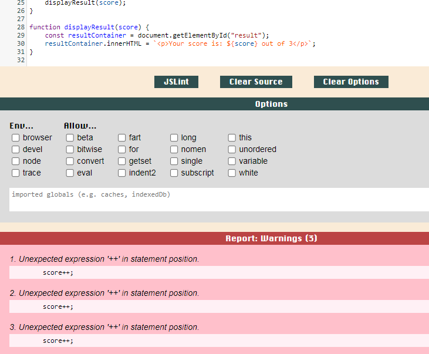

# Pyrlandia Travel Site
## Description
The purpose of this site is to provide prospective tourists and visitors the main highlights of our wonderful country. And to convince them to come here rather than to any other mythical realm to which they might be considering (including Trollheim!!!).   
- I wanted to create this website which combines two of my passions: Travel and Fantasy.
- I built this website in order to showcase what I have learned so far through my level 5 diploma in Coding using Javascript along with HTML and CSS.
- Troughout this project so far I have grown in confidence and feel like I can easily build a website from scratch, and also make it interactive for the user, something  I previously did not feel capable to do.
- From studying the course material and other resources on the web, I have learned lots of different ways to get the ideas from my head to the code of my wensite. It's been a thrilling ride!
 
## UX design

I wanted to make the user experience as easy to use but at the same time making the website unique and interesting to use. 

WireFrame

On the About page - and Tours page - there is a form which the user can fill in and once they press Submit there is a Javascript function which validates whether the details have been entered correctly, if so a success message is posted on a popup as seen below.

## Bugs and Testing

There was a problem with the quiz.html not showing the script from quiz.js, and also showing the div above the headers , and also not showing the h1 heading. Trying to figure out what's gone on there...

My Forms weren't quite working correctly , they were supposed to check whether the email entered is a valid email address, but they didnt seem to be doing that... so I simplified the code, and now it is working fine

JS Lint

Below is the result on JS Lint when I enter the Code from form.js:

And below is the result when I entered the code from quiz.js:

3 Warnings were given, I spent some good time on stack overflow to see if other people had the same problem, and it seems like its a common occurrence and most people are saying it´s best just to ignore it, and seeing that it is a reqisite of p2.2 that i should have a loop, and also the wording saying there should be no "major" warnings I thought I could ignore it and put it down as a minor warning for the purpose of this excercise.

I have used a mixture of manual testing and automated testing in the creation of this website, the automated testing makes sure that it is in line with accepted standards, and the manual testing makes sure that it is comfortable for the user to use and has the correct level of interactivity.

## Deployment
My site was deployed on github pages at https://melissabuckingham.github.io/Pyrlandia/

## Credits
I used the Love Running project for inspiration including for the hero image inclusion and the responsiveness on smaler screened devices.
I drew inspiration from geeksforgeeks.org and sitepoint.com, for the quiz section of the website. 